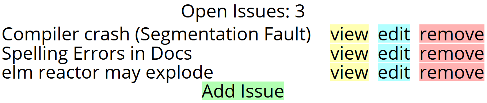
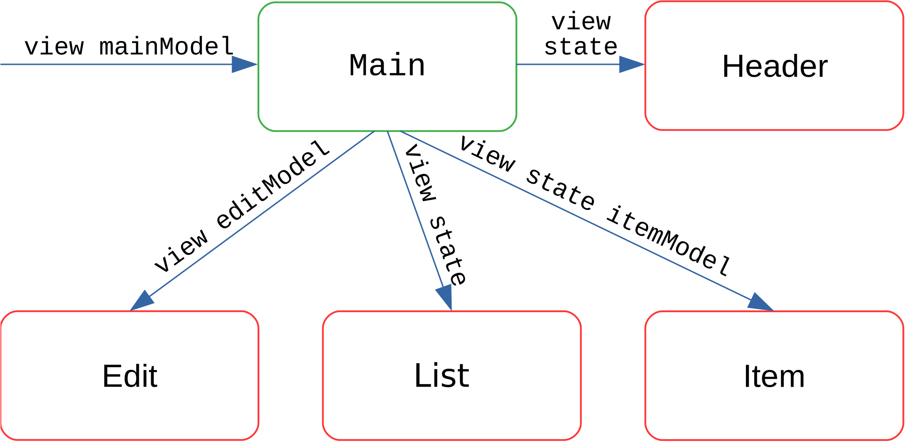
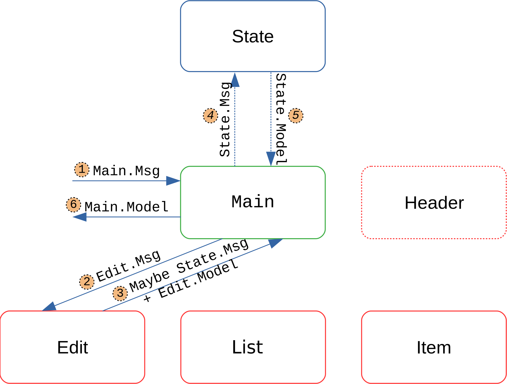

# Shared State in Elm

## Introduction

In Elm, nested or separate pages may want to share information among each other.
However, realizing this comes with several challenges related to consistency and redundancy.
Because of the added complexity of additional modules, it is often discouraged to split up functionality into multiple modules if information parts of the model need to be shared.

Instead, files may be larger in size and consist of one rather complex module.
In [The life of a file](https://www.youtube.com/watch?v=XpDsk374LDE), [Czaplicki](https://github.com/evancz) talks about this refactoring task and possible solutions.
He emphasizes that large files can still be controlled and are not more error prone because of cheap refactoring and the absence of 'sneaky mutations'.

If **independent** pieces of code exist which in addition may be reusable, he recommends to extract this functionality into a separate module.
The architecture then uses the API of this module which is reduced to the minimum and hides its implementation details.
Thus, it is **reusable** and **consistent**, in essence, mutations to the model are only possible in a predefined way.

Since a model can only be used and stored in **one** other model and often, information needs to be shared among multiple modules, a different solution is needed.

With the help of this example application, we propose how a state of either a single page application or components in a more complex module may be shared among each other.
The shared model is stored in a higher level module, in this case the `Main.elm`, and its information can be accessed and mutated by individual components using the predefined minimalistic API.

## Related Work

[Hanhinen](https://github.com/ohanhi) proposed a concept of a shared state which can be found at
[elm-shared-state](https://github.com/ohanhi/elm-shared-state).
In their version, the `SharedState` model holds information which is used by several submodules.
The information is sent to each submodule via the added parameter in the respective functions view and update:

```elm
view : SharedState -> Model -> Html Msg
```

Additionally, the `update` functions of respective submodules return a `SharedStateUpdate` message which is processed by the `SharedState` module and used to update the state.
This way, the submodules using the state do not have a direct way to manipulate it.

Therefore, the `update` function now looks like this:

```elm
update : SharedState -> Msg -> Model -> ( Model, Cmd Msg, SharedStateUpdate )
```

## Description of our approach

We extended the approach from [Hanhinen](https://github.com/ohanhi) and use an example single page application to show our findings.
The example site is a simple issue tracker:

  

It keeps track of a list of issues which are stored in the shared `State`.

```elm
type alias State = { list : List String }
```

The set of possible changes to the `State` are defined as messages and only modifiable with the `update` function which is defined as follows:

```elm
update : Msg -> State -> State
```

### Modules

The application is comprised of the following four modules:

- The `List` module presents an overview of the issues. From here, issues may be created, viewed, updated or deleted.
- An issue can be edited on the `Edit` page.
- Issues can be read on the `Item` page.
- Additionally, a `Header` shows the current number of issues.

### View

The following figure gives an overview of the `view` functionality:



Most submodules need information held by the `State`, thus it is passed to respective `view` function.
The modules display the respective view using both the shared state and their module.

### Update

The following figure gives an overview of the `update` functionality:



First, an update in Main is triggered.
Then, `Edit.update` is called with the present `Edit.Msg` message which looks like the following:

```elm
type Msg
    = SetText String      -- Edit the text in the TextField
    | GoBack              -- Go back to the Overview
    | StateMsg State.Msg  -- Change the State
```
The `StateMsg` is of great interest.
It is triggered whenever a change in the `State` is needed.
In our case, clicking the save button triggers the message `StateMsg (EditIssue selectIdx text)` which is then passed to the following `update` function:

```elm
update : Key -> Msg -> Model -> ( Model, Cmd Msg, Maybe State.Msg )
update key msg model =
    case msg of
        SetText text ->
            ( { model | text = text }, Cmd.none, Nothing )

        GoBack ->
            ( model, Route.pushUrl key Route.List, Nothing )

        StateMsg stateMsg ->
            ( model, Cmd.none, Just stateMsg )
```

The `StateMsg` is wrapped in a `Maybe` monad and only returned when an update of the `State` is needed.
The `update` function thus returns `Just (EditIssue selectIdx text)` as the state update message.

The message type `StateMsg State.Msg` is introduced in every submodule which needs to update the state (`Header` only consists of a view).
This makes the update functions both smaller and more easily extensible.

`Main` now calls the `update` function of the state with the returned message.
This only happens if a `StateMsg` is present, so steps four and five are optional.
The new state is returned and saved along side the `Edit.Module`.

## Discussion

<!--Overview-->
A shared state can be used to improve consistency and avoid redundancy when information needs to be shared among multiple modules.

<!--Advantages-->
The state module has a defined API which means that its model can only be mutated using the existing messages.
The implementation is therefore hidden from the user.
This is crucial to the design since it ensures data consistency and makes it easy to manage the set of possible state mutations.
In addition, the API can be tested more easily.

<!--Alternatives-->
Alternatively, submodules could each hold a respective subset of the higher level model.
This makes the implementation of submodules straightforward, but also prone to errors.
Since parts of the state are held in multiple models, the **single source of truth** principle is violated and redundancy is introduced.

Also, it could be an option to model the application in a single module.
Technically speaking, this would not harm data consistency or modeling capability.
However, breaking up the code in submodules is often times sensible because it improves the separation of concerns and makes the tasks of each module more apparent.

<!--Problems-->
Improvements can also be made with respect to security.
Submodules, which are only allowed to mutate a subset of the state, still have access to any of the defined messages.
Different types of `update` messages may be defined in the shared state mitigate this issue.


<!--State Subscription-->
With the presented architecture, it is not intended for submodules to propagate updates to models of other submodules.
In essence, it is not possible for A to trigger an event that changes the model of B without the shared state holding the respective information.
However, this type of update is useful and as of now renders a drawback to the shared state approach.
For example, it would be beneficial if a change in a selection that is a state change would display a modal in a different module.

The proposed update process may therefore be extended by a subscription system.
In this architecture, submodules would subscribe to state messages and receive updates when respective messages are processed by the shared state.

## Try it yourself

You can try this example application by cloning this repository and building the elm app.

For example, run:

```sh
git clone https://github.com/CurrySoftware/elm-shared-state-example
cd elm-shared-state-example
elm reactor
```

Feel free to submit issues with the approach or request clarification.